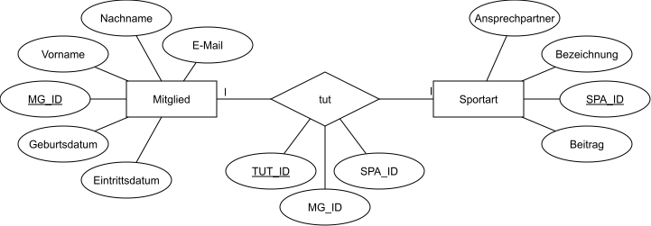

# MitgliederverwaltungSportverein
This is a Mitgliederverwaltung for an imaginary Sportverein :)

```pip install --no-cache-dir --upgrade -r /code/requirements.txt```

Run docker container:
```docker run -d --name MVS -p 80:80 myimage```

# ERM

